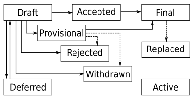

.. _skip0:

============================
SKIP 0 — Purpose and Process
============================

:Author: Jarrod Millman <millman@berkeley.edu>
:Author: Juan Nunez-Iglesias <juan.nunez-iglesias@monash.edu>
:Author: Stéfan van der Walt <stefanv@berkeley.edu>
:Status: Active
:Type: Process
:Created: 2019-07-30

What is a SKIP?
---------------

SKIP stands for **s**\ ci\ **k**\ it-\ **i**\ mage **p**\ roposal. A SKIP is a design document providing
information to the community, or describing a new feature for
scikit-image or its processes or environment. The SKIP should provide a
rationale for the proposed change as well as a concise technical
specification, if applicable.

We intend SKIPs to be the primary mechanisms for proposing major new
features, for collecting community input on an issue, and for
documenting the design decisions that have gone into scikit-image. The SKIP
author is responsible for building consensus within the community and
documenting dissenting opinions.

Because the SKIPs are maintained as text files in a versioned
repository, their revision history is the historical record of the
feature proposal [1]_.

Types
^^^^^

There are three kinds of SKIPs:

1. A **Standards Track** SKIP describes a new feature or implementation
   for scikit-image.

2. An **Informational** SKIP describes a scikit-image design issue, or provides
   general guidelines or information to the Python community, but does not
   propose a new feature. Informational SKIPs do not necessarily represent a
   scikit-image community consensus or recommendation, so users and
   implementers are free to ignore Informational SKIPs.

3. A **Process** SKIP describes a process surrounding scikit-image, or
   proposes a change to (or an event in) a process. Process SKIPs are
   like Standards Track SKIPs but apply to areas other than the scikit-image
   library itself. They may propose an implementation, but not to
   scikit-image's codebase; they require community consensus. Examples include
   procedures, guidelines, changes to the decision-making process, and changes
   to the tools or environment used in scikit-image development. Any meta-SKIP
   is also considered a Process SKIP.

SKIP Workflow
-------------

The SKIP process begins with a new idea for scikit-image. A SKIP should contain
a single key proposal or new idea. Small enhancements or patches often don't
need a SKIP and can be injected into the scikit-image development workflow
with a pull request to the scikit-image `repo`_. The more focused the
SKIP, the more likely it is to be accepted.

Each SKIP must have a champion---someone who writes the SKIP using the style
and format described below, shepherds the discussions in the appropriate
forums, and attempts to build community consensus around the idea.  The SKIP
champion (a.k.a. Author) should first attempt to ascertain whether the idea is
suitable for a SKIP. Posting to the scikit-image `mailing list`_ is the best
way to do this.

The proposal should be submitted as a draft SKIP via a `GitHub pull
request`_ to the ``doc/source/skips`` directory with the name
``skip-<n>.rst`` where ``<n>`` is an appropriately assigned number (e.g.,
``skip-35.rst``). The draft must use the :ref:`skip_template` file.

Once the PR is in place, the SKIP should be announced on the mailing
list for discussion (comments on the PR itself should be restricted to
minor editorial and technical fixes).

At the earliest convenience, the PR should be merged (regardless of whether it
is accepted during discussion). A SKIP that outlines a coherent argument and
that is considered reasonably complete should be merged optimistically,
regardless of whether it is accepted during discussion. Additional PRs may be
made by the author to update or expand the SKIP, or by maintainers to set its
status, discussion URL, etc.

Standards Track SKIPs consist of two parts, a design document and a
reference implementation. It is generally recommended that at least a
prototype implementation be co-developed with the SKIP, as ideas that sound
good in principle sometimes turn out to be impractical. Often it makes sense
for the prototype implementation to be made available as PR to the scikit-image
repo, as long as it is properly marked as WIP (work in progress).

Review and Resolution
^^^^^^^^^^^^^^^^^^^^^

SKIPs are discussed on the mailing list.  The possible paths of the
status of SKIPs are as follows:

All SKIPs should be created with the ``Draft`` status.

Eventually, after discussion, there may be a consensus that the SKIP
should be accepted – see the next section for details. At this point
the status becomes ``Accepted``.

Once a SKIP has been ``Accepted``, the reference implementation must be
completed. When the reference implementation is complete and incorporated
into the main source code repository, the status will be changed to ``Final``.

To allow gathering of additional design and interface feedback before
committing to long term stability for a language feature or standard library
API, a SKIP may also be marked as "Provisional". This is short for
"Provisionally Accepted", and indicates that the proposal has been accepted for
inclusion in the reference implementation, but additional user feedback is
needed before the full design can be considered "Final". Unlike regular
accepted SKIPs, provisionally accepted SKIPs may still be Rejected or Withdrawn
even after the related changes have been included in a release.

Wherever possible, it is considered preferable to reduce the scope of a
proposal to avoid the need to rely on the "Provisional" status (e.g. by
deferring some features to later SKIPs), as this status can lead to version
compatibility challenges in the wider ecosystem.

A SKIP can also be assigned status ``Deferred``. The SKIP author or a
core developer can assign the SKIP this status when no progress is being made
on the SKIP.

A SKIP can also be ``Rejected``. Perhaps after all is said and done it
was not a good idea. It is still important to have a record of this
fact. The ``Withdrawn`` status is similar---it means that the SKIP author
themselves has decided that the SKIP is actually a bad idea, or has
accepted that a competing proposal is a better alternative.

When a SKIP is ``Accepted``, ``Rejected``, or ``Withdrawn``, the SKIP should be
updated accordingly. In addition to updating the status field, at the very
least the ``Resolution`` header should be added with a link to the relevant
post in the mailing list archives.

SKIPs can also be ``Superseded`` by a different SKIP, rendering the
original obsolete. The ``Replaced-By`` and ``Replaces`` headers
should be added to the original and new SKIPs respectively.

Process SKIPs may also have a status of ``Active`` if they are never
meant to be completed, e.g. SKIP 0 (this SKIP).

How a SKIP becomes Accepted
^^^^^^^^^^^^^^^^^^^^^^^^^^^

A SKIP is ``Accepted`` by consensus of all interested contributors. We
need a concrete way to tell whether consensus has been reached. When
you think a SKIP is ready to accept, send an email to the
scikit-image mailing list with a subject like:

  Proposal to accept SKIP #<number>: <title>

In the body of your email, you should:

* link to the latest version of the SKIP,

* briefly describe any major points of contention and how they were
  resolved,

* include a sentence like: "If there are no substantive objections
  within 7 days from this email, then the SKIP will be accepted; see
  SKIP 0 for more details."

For an equivalent example in the NumPy library, see: https://mail.python.org/pipermail/numpy-discussion/2018-June/078345.html

After you send the email, you should make sure to link to the email
thread from the ``Discussion`` section of the SKIP, so that people can
find it later.

Generally the SKIP author will be the one to send this email, but
anyone can do it – the important thing is to make sure that everyone
knows when a SKIP is on the verge of acceptance, and give them a final
chance to respond. If there's some special reason to extend this final
comment period beyond 7 days, then that's fine, just say so in the
email. You shouldn't do less than 7 days, because sometimes people are
travelling or similar and need some time to respond.

In general, the goal is to make sure that the community has consensus,
not provide a rigid policy for people to try to game. When in doubt,
err on the side of asking for more feedback and looking for
opportunities to compromise.

If the final comment period passes without any substantive objections,
then the SKIP can officially be marked ``Accepted``. You should send a
followup email notifying the list (celebratory emoji optional but
encouraged 🎉✨), and then update the SKIP by setting its ``:Status:``
to ``Accepted``, and its ``:Resolution:`` header to a link to your
followup email.

If there *are* substantive objections, then the SKIP remains in
``Draft`` state, discussion continues as normal, and it can be
proposed for acceptance again later once the objections are resolved.

In unusual cases, when no consensus can be reached between core developers, the
`scikit-image Steering Council`_ may be asked to decide whether a controversial
SKIP is ``Accepted``.

Maintenance
^^^^^^^^^^^

In general, Standards track SKIPs are no longer modified after they have
reached the Final state, as the code and project documentation are considered
the ultimate reference for the implemented feature. They may, however, be
updated under special circumstances.

Process SKIPs may be updated over time to reflect changes
to development practices and other details. The precise process followed in
these cases will depend on the nature and purpose of the SKIP being updated.

Format and Template
-------------------

SKIPs are UTF-8 encoded text files using the reStructuredText_ format.  Please
see the :ref:`skip_template` file and the reStructuredTextPrimer_ for more
information.  We use Sphinx_ to convert SKIPs to HTML for viewing on the web
[2]_.

Header Preamble
^^^^^^^^^^^^^^^

Each SKIP must begin with a header preamble.  The headers
must appear in the following order.  Headers marked with ``*`` are
optional.  All other headers are required. ::

    :Author: <list of authors' real names and optionally, email addresses>
    :Status: <Draft | Active | Accepted | Deferred | Rejected |
             Withdrawn | Final | Superseded>
    :Type: <Standards Track | Process>
    :Created: <date created on, in dd-mmm-yyyy format>
  * :Requires: <skip numbers>
  * :skimage-Version: <version number>
  * :Replaces: <skip number>
  * :Replaced-By: <skip number>
  * :Resolution: <url>

The Author header lists the names, and optionally the email addresses
of all the authors of the SKIP.  The format of the Author header
value must be

    Random J. User <address@dom.ain>

if the email address is included, and just

    Random J. User

if the address is not given.  If there are multiple authors, each should be on
a separate line.

Discussion
----------

- https://github.com/scikit-image/scikit-image/pull/3585

References and Footnotes
------------------------

.. [1] This historical record is available by the normal git commands
   for retrieving older revisions, and can also be browsed on
   `GitHub <https://github.com/scikit-image/scikit-image/tree/master/doc/source/skips>`_.

.. [2] The URL for viewing SKIPs on the web is
   https://scikit-image.org/skips/index.html

.. _repo: https://github.com/scikit-image/scikit-image

.. _mailing list: https://mail.python.org/mailman/listinfo/scikit-image

.. _issue tracker: https://github.com/scikit-image/scikit-image/issues

.. _scikit-image Steering Council:
   https://scikit-image.org/skips/1-governance.html

.. _`GitHub pull request`: https://github.com/scikit-image/scikit-image/pulls

.. _reStructuredText: http://docutils.sourceforge.net/rst.html

.. _reStructuredTextPrimer: http://www.sphinx-doc.org/en/stable/rest.html

.. _Sphinx: http://www.sphinx-doc.org/en/stable/

Copyright
---------

This document has been placed in the public domain.
